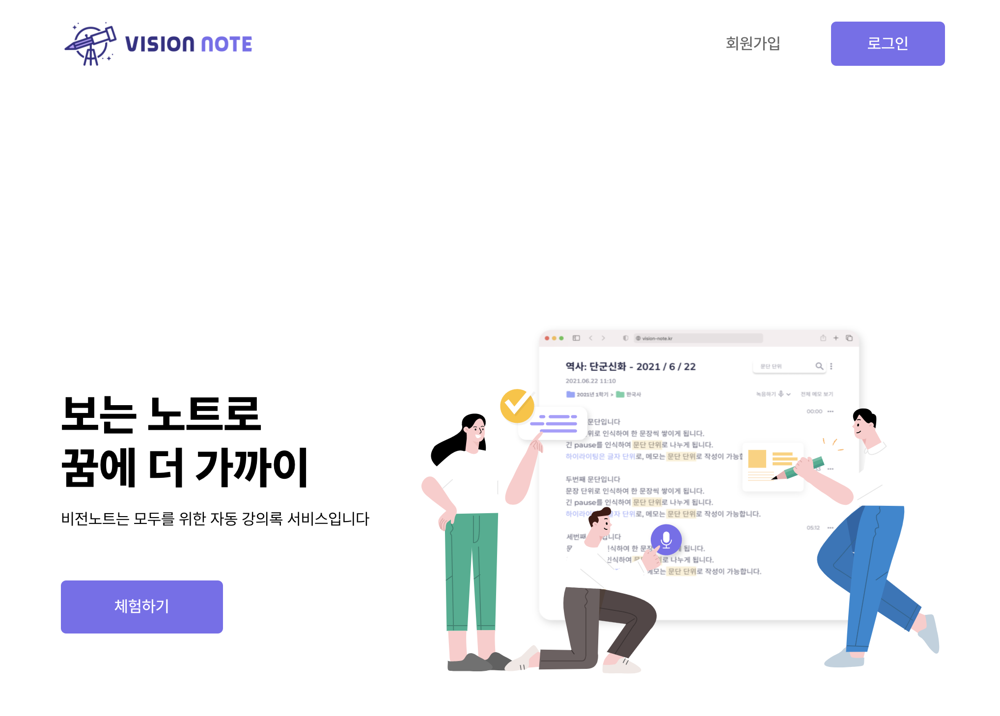
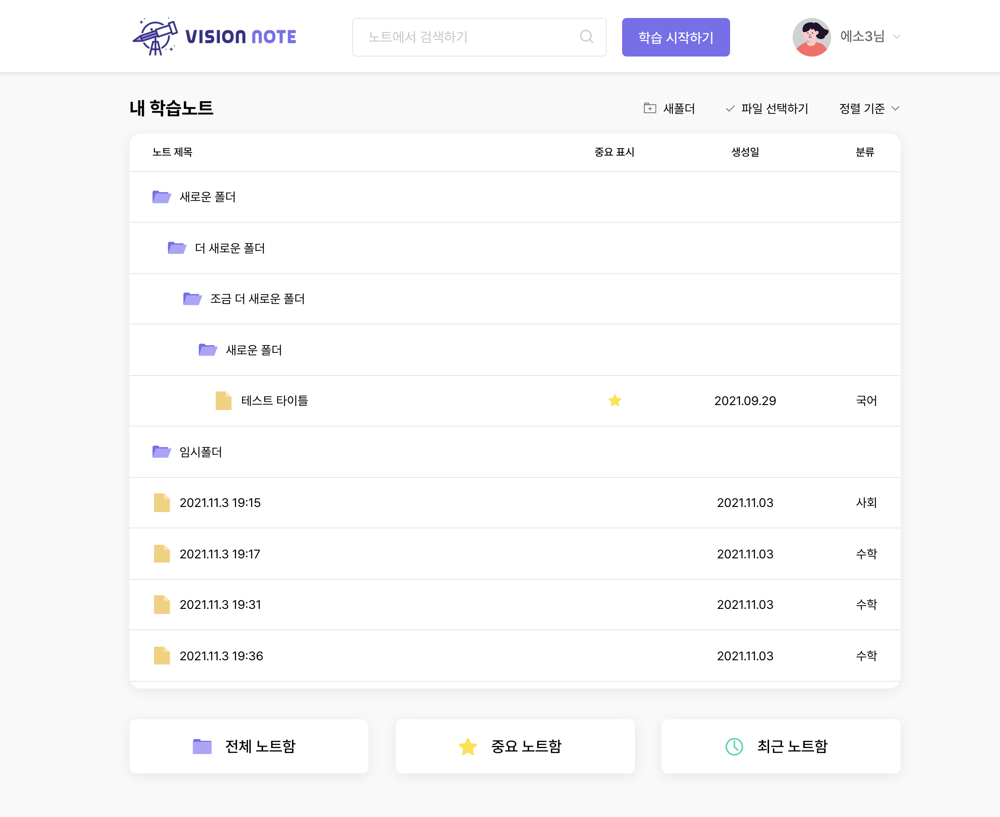
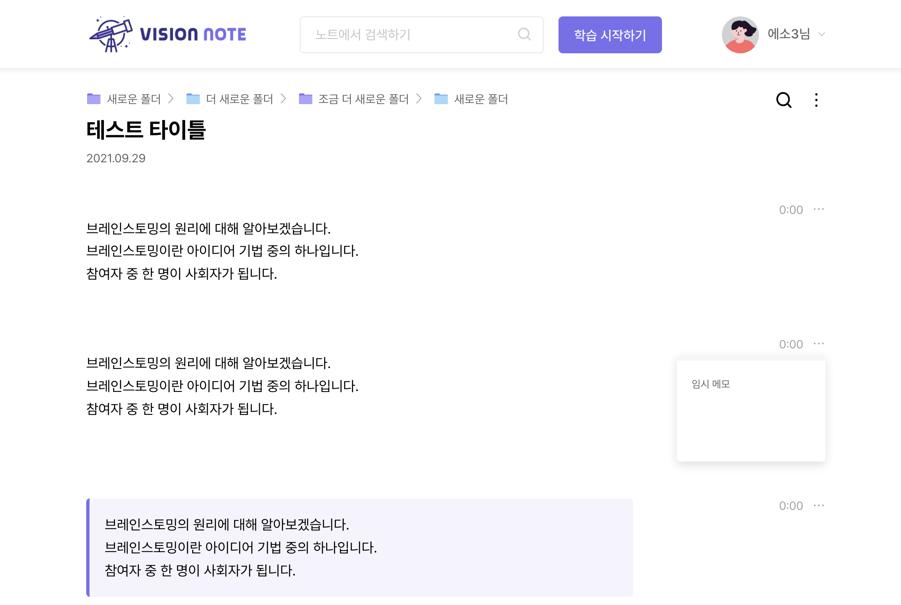
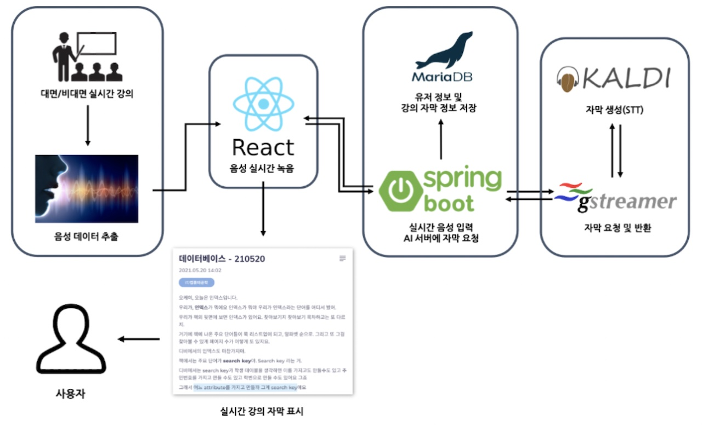
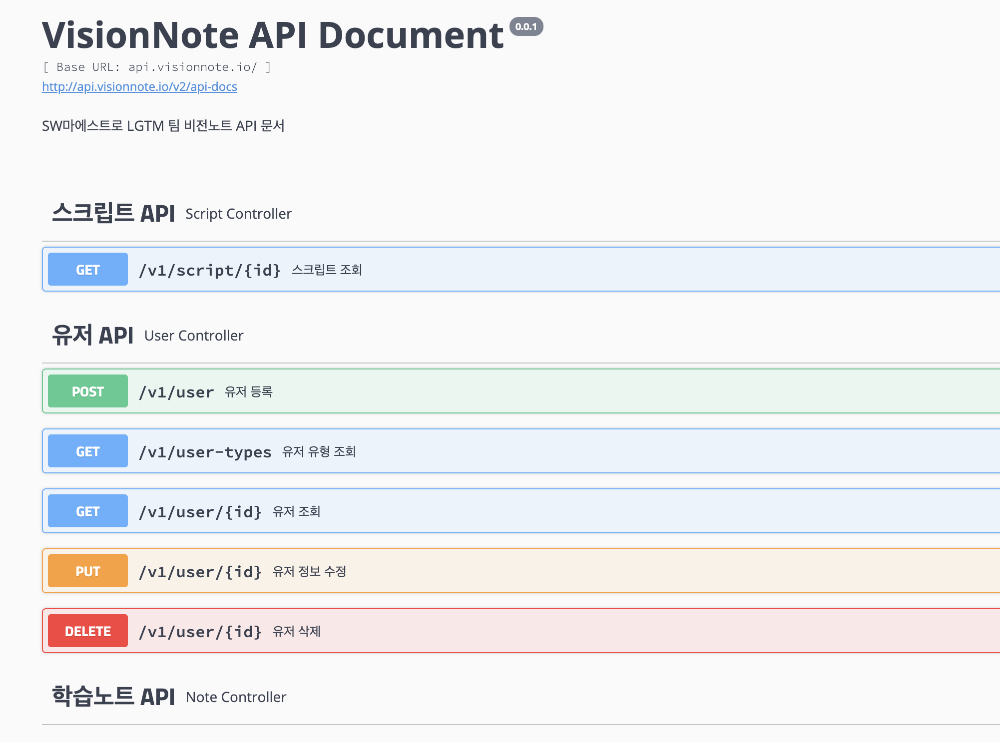
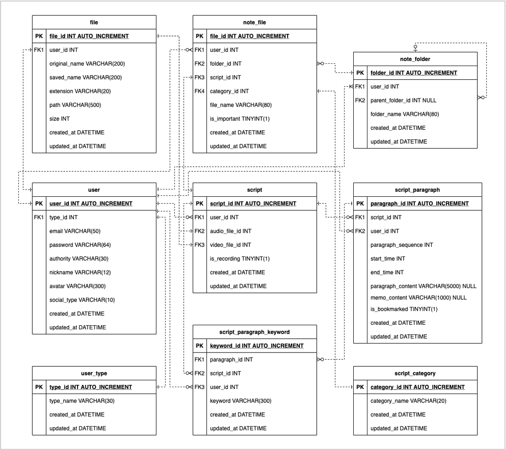

# vision-note-back
LGTM 팀 비전노트 서비스 RESTful API 서버

### Overview
* 비전노트(Vision Note) - 청각장애 학생을 위한 자동 강의록 생성 웹 서비스
* 비대면 강의 음성을 녹음하여 STT 모델을 통해 자막을 생성하고, 학습노트 형태로 손쉽게 관리
* 백엔드 서버에서는 프론트엔드 서버가 넘겨준 오디오 데이터를 재조합하여 AI 서버에 넘기고 처리 결과를 DB에 저장하는 역할을 담당
* RESTful API 형태로 구현된 각 endpoint는 Swagger UI를 통해 자동으로 API 문서로 변환
* 민감 정보는 Jasypt를 사용하여 암호화
* https://api.visionnote.io 에 Docker Image 기반으로 배포됨

### Tech stack
* Spring Boot + Gradle
* Jasypt
* MyBatis
* MariaDB
* Swagger UI
* AWS Lightsail, EC2, RDS

### Screenshots

### Structure

## Caution
* 실행 시 OS 환경변수에 적절한 JASYPT_ENCRYPTOR_PASSWORD 지정해 줄 것